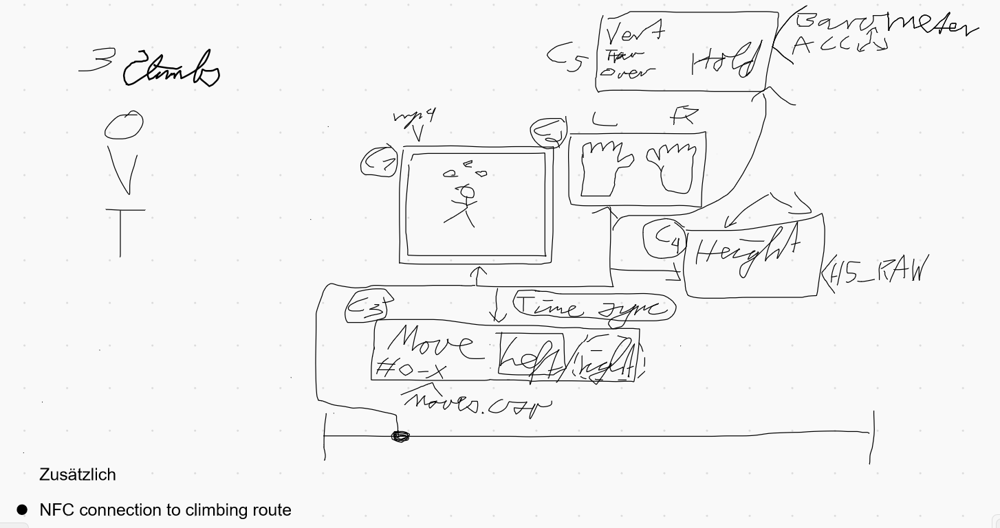

# Try the App here:
# [https://github.com/SimRunBot/gipfelcoder](https://simrunbot.github.io/gipfelcoder/)

## Ideasketch

## TODO
C1 (Simon)
C2 (Philipp)
Draft hand in 10am
Draft hand in at 17pm
##
compare stats of route to other climbers 
geschwindigkeit (dauer )
average values 

## Libraries used:

## Create React App
This project was bootstrapped with [Create React App](https://github.com/facebook/create-react-app)

## How to run locally
clone to local directory
In the project directory, you can run:

### `npm start`

Runs the app in the development mode.\
Open [http://localhost:3000](http://localhost:3000) to view it in the browser.

The page will reload if you make edits.\
You will also see any lint errors in the console.

## Learn More

You can learn more in the [Create React App documentation](https://facebook.github.io/create-react-app/docs/getting-started).

To learn React, check out the [React documentation](https://reactjs.org/).
